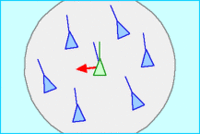
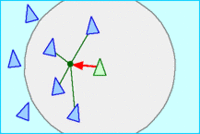
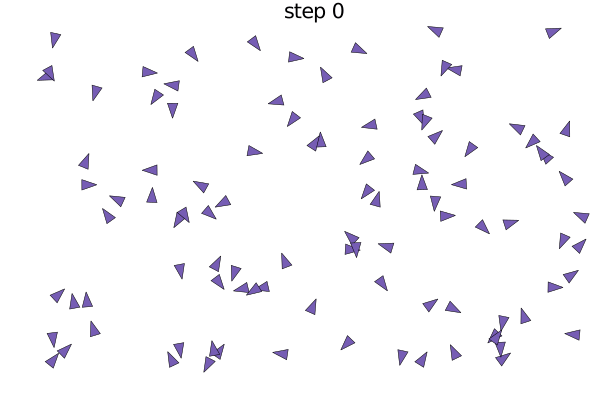

# Flocking RRK
## Equipo
- Karla Valeria Perez Perez
- Rogelio Robledo Moreno
- Raúl Sánchez Vázquez

## Concepto
El comportamiento de bandada o flocking es el comportamiento exhibido cuando un grupo de pájaros, llamado bandada busca alimento o está volando.

## Antecedentes
Boids es un programa de vida artificial , desarrollado por Craig Reynolds en 1986, que simula el comportamiento de bandadas de aves . Su artículo sobre este tema fue publicado en 1987 en las actas de la conferencia ACM SIGGRAPH.

## Modelo básico
1. Separación: evitar aglomeración de vecinos (repulsión de corto alcance)

2. Alineación: dirigir hacia un rubro promedio de vecinos.

3. Cohesión: dirigir hacia la posición media de los vecinos (atracción de largo alcance)

## Aplicaciones
1. Medio para controlar el comportamiento de vehículos aéreos no tripulados.
2. Para generar multitudes que se mueven de manera más realista en animaciones.

### Flocking para la bolsa
En un conjunto de acciones, las acciones líderes son aquellas que se mueven con más velocidad que las demás, bien al alza o a la baja. Si nosotros entramos en el bloque de acciones que empuja hacia arriba la bandada, y seguimos entrando y saliendo sistemáticamente en las acciones que más tiran hacia arriba (o hacia abajo) del grupo, conseguiremos estar siempre en la dirección correcta, siguiendo a la cabeza de la bandada.

## Implementación
### Online
[Implementación online](https://repl.it/@raulcrush/flocking-rrk)
### Offline
1. Instalar el compilador de julia
2. Clonar repositorio git
3. Ejecutar programa boids.jl

## Resultados

## Referencias
1. Reynolds, C. W. (1987) Flocks, Herds, and Schools: A Distributed Behavioral Model, in Computer Graphics, 21(4) (SIGGRAPH '87 Conference Proceedings) pages 25-34.
2. http://www.cs.toronto.edu/~dt/siggraph97-course/cwr87/
3. http://harry.me/blog/2011/02/17/neat-algorithms-flocking/
4. https://juliadynamics.github.io/Agents.jl/stable/examples/flock/
5. https://github.com/JuliaDynamics/Agents.jl/blob/master/examples/flock.jl
6. https://www.oreilly.com/library/view/ai-for-game/0596005555/ch04.html
7. https://slowinver.com/algoritmo-bandada/
